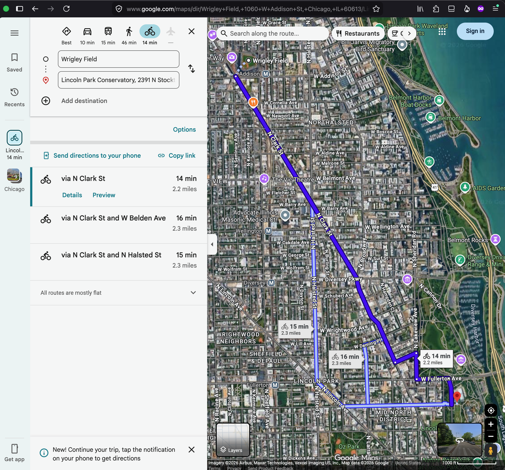
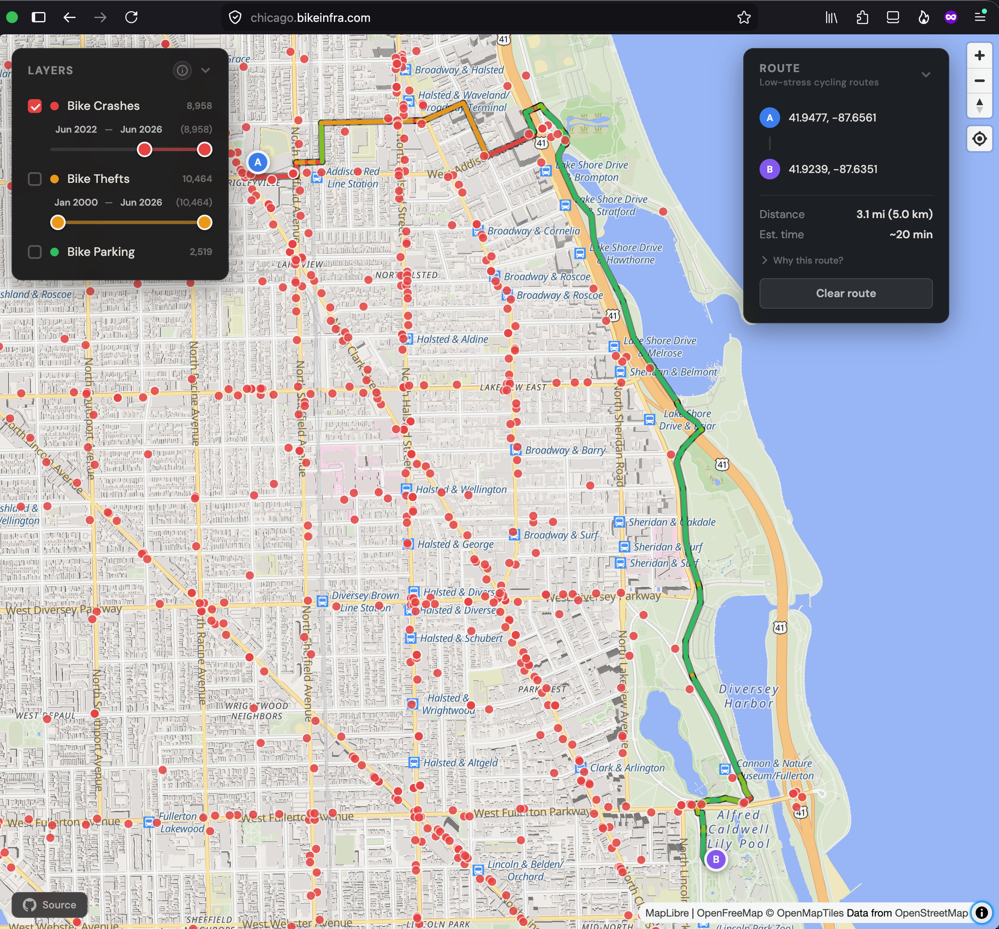
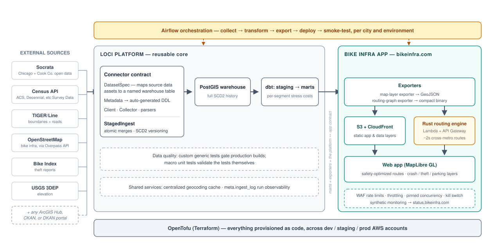

# Loci Platform

A production sandbox for data engineering: a monorepo where I develop data-platform patterns — ingestion contracts, SCD2 warehousing, dbt transformation, orchestration, and infrastructure-as-code — and prove them by running real applications on them. The flagship application is [bikeinfra.com](https://bikeinfra.com): safety-optimized bike routing built from open civic data, live in multiple metros.

**Live:** [bikeinfra.com](https://bikeinfra.com) · [status.bikeinfra.com](https://status.bikeinfra.com) · Write-ups: [why safety-optimized routing](https://matttriano.dev/posts/021_bike_map/bike_map_routing_tool.html) · [the Python → Rust rewrite](https://matttriano.dev/posts/022_bike_infra_rust/routing_algo_rust_refactor.html)

<p align="center">
  
  
</p>

## The system at a glance

- **Live in [N] metros** (Chicago, SF Bay, NYC, Boston, Denver, Detroit, Madison WI, New Orleans, Portland OR, Toronto, and Washington DC), each with its own routing graph and data layers, built and deployed per city and per environment.
- **Routing:** cross-metro routes in **~2s** and short trips in under **~0.5s** from a **4.9MB** Rust Lambda with **1–2s** cold starts, on AWS free-tier compute.
- **Scale:**
    - ~750k-edge routing graphs of road segments scored for safety per metro
    - 100ks of datasets available through the already-implemented data collectors
    - 100s of Airflow DAGs each orchestrating regular data collections to update datasets tracked with their full **SCD2 history**.
- **Cost:** **~$10/month** total across dev/staging/prod — mostly DNS and edge security; compute stays inside the free tier by design.
- **Reliability:** synthetic monitoring with a public status page: [status.bikeinfra.com](https://status.bikeinfra.com). 100.0000% uptime for each site from launch to the time of writing (thanks to a careful dev > staging > prod release cycle).



## Core engineering highlights

The load-bearing ideas, in reading order:

1. **The connector contract** — how a new data source plugs in through one small spec:
    - [Spec](platform/airflow/dags/loci/collectors/socrata/spec.py) (Socrata): maps a set of data assets at a source to a target warehouse table
    - [Metadata](platform/airflow/dags/loci/collectors/census/metadata.py) (Census): explores a source and generates table DDL from its schema
    - [Client](platform/airflow/dags/loci/collectors/arcgishub/client.py) (ArcGIS Hub): handles communication with a source's API
    - [Collector](platform/airflow/dags/loci/collectors/osm/collector.py) (OSM): orchestrates fetch → normalize → ingest for a dataset
2. **`PostgresEngine` and `StagedIngest`** — atomic staged merges, SCD2 versioning, type-OID geometry handling: [loci/db/core.py](platform/airflow/dags/loci/db/core.py)
3. **Custom generic dbt tests, and the tests that test them** — including polarity tests that assert a generic test fires on bad fixtures and stays silent on good ones: [platform/dbt/tests/macros/](platform/dbt/tests/macros/)
4. **End-to-end Airflow DAGs** — collect → transform → export → deploy → smoke-test, per city and environment: [all-cities DAG](platform/airflow/dags/dag_files/refresh_bike_map_all.py) · [NYC DAG](platform/airflow/dags/dag_files/refresh_bike_map_nyc.py)
5. **The Rust routing engine** — the hot path that made cross-metro routing serverless-viable: [services/routing/](services/routing/routing-core/src/)
6. **Infrastructure as code** — per-environment state backends, CloudFront/OAC, WAF rate limiting, budget kill switch: [infra/](infra/)

## The core idea: `DatasetSpec`

The most reusable part of this platform is its ingestion contract. A `DatasetSpec` maps a set of data assets at a source to a named table in the warehouse — it carries the target table and schema, the entity key for SCD2 tracking, and source-specific configuration (dataset IDs, API endpoints, geography levels, tag filters). Everything downstream derives from the spec:

- **Metadata classes** discover the source's schema and `generate_ddl()` — column types, comments, SCD2 tracking columns, and constraints — directly from source schema information, so adding a source never means hand-writing DDL.
- **`StagedIngest`** reads the spec's `entity_key` to choose the write path automatically: SCD2 merge (hash-compare, close out superseded rows, insert new versions) when a key exists, `INSERT ... ON CONFLICT` when it doesn't.
- **`DbtModelGenerator`** scaffolds staging models and `sources.yml` entries following project conventions, idempotently.

The result: adding a civic data source is a small, uniform amount of work, and every source gets full history, atomic ingestion, and generated boilerplate for free. Sources currently flowing through the contract: Socrata (Chicago and Cook County open data), the Census API, TIGER/Line, OpenStreetMap (via Overpass), and Bike Index. The contract also generalizes across portal *types* — there are connectors for any ArcGIS Hub, CKAN, or DKAN portal — which, together with Socrata, covers most of the platforms that host civic open data.

## Design decisions

Choices I'd defend, with reasoning written down:

- **Batch, not streaming.** Civic data updates daily-to-monthly; streaming infrastructure would be complexity without a customer. The Airflow scheduling layer distinguishes incremental crons from full-refresh crons instead.
- **SCD2 at ingestion, not transformation.** History capture is a property of landing data, not of modeling it; putting it in the shared ingestion path means no source can opt out by accident.
- **Rewrite the hot path, keep the platform in Python.** The routing engine moved to Rust because its scaling was structural (superlinear in route length) — cutting cross-metro latency ~16s → ~2s, cold starts 8–15s → 1–2s, and the deployment artifact 67MB → 4.9MB. Everything else stays in Python because iteration speed dominates. Full reasoning, benchmarks, and the complexity I chose *not* to build: [the rewrite post](https://matttriano.dev/posts/022_bike_infra_rust/routing_algo_rust_refactor.html).
- **Cost as a design constraint.** Layered abuse defenses (WAF per-IP rate limiting, API Gateway throttling, pinned Lambda concurrency, a budget-triggered kill switch) exist so the service can be public without being a liability.

## Current work

- Extracting the collector framework and database-engine tooling into an installable package.
- Adding an `IcebergEngine` alongside `PostgresEngine`, so an Iceberg collection mode can feed a PySpark transformation path parallel to the dbt + PostGIS warehouse path.
- Extending the `DbtPipelineBuilder` subclasses (Socrata, TIGER, OSM) so adding a new dataset is a one-liner that generates the staging model, updates `sources.yml`, and wires up SCD2/column-aliasing conventions.
- More mart models: bike infrastructure quality layers, cyclist points of interest, crash-severity heatmaps with grid-based pre-aggregation.
- Additional applications on the same collect → transform → export → deploy pattern — the warehouse already holds crimes, building permits, food inspections, Census demographics, and transit ridership, which support neighborhood dashboards, transit accessibility analysis, and property/zoning tools.

This repo is a living platform, not a frozen portfolio piece — expect active development.

---

## Platform reference

Loci is a data platform for collecting, transforming, and serving geospatial data. The name comes from what the sandbox is for: experimenting with architectural components to find a *critical locus* — a set of optimal constraint-satisfying points — for a given data engineering situation.

**Deployment model:** the orchestration and warehouse plane (Airflow, PostGIS, dbt) runs on a single machine via Podman Compose — a deliberate cost decision, with the architecture designed to need little RAM so it stays cheap on modest hardware. Applications build locally and deploy to AWS, where OpenTofu manages resources across dev, staging, and prod via per-environment state backends.

### Data sources

Data is collected into a PostGIS warehouse from external sources including:

- **Socrata** — Chicago and Cook County open data portals: traffic crashes (three related tables), crimes, arrests, bike racks, building permits, food inspections, business licenses, CTA ridership, and more.
- **Census API** — American Community Survey tables at various geography levels (tract, block group, etc.).
- **TIGER/Line** — Census boundary and geographic feature shapefiles (tracts, counties, roads, railroads, water features) across multiple vintages.
- **OpenStreetMap** — queried via the Overpass API; used for the bike network, bike infrastructure, points of interest, and parks.
- **Bike Index** — stolen-bike reports.

Portal-type connectors (ArcGIS Hub, CKAN, DKAN) extend the same contract to any portal running those platforms.

### Collector architecture

Each source's collector is built on a shared set of abstractions:

- **Specs** define what to collect. Each source has a dataclass-based spec type (`SocrataDatasetSpec`, `CensusDatasetSpec`, `OsmDatasetSpec`, ...) inheriting from a common `DatasetSpec` base.
- **Clients** handle communication with external APIs — pagination, retries, query construction. Clients are separate from collectors so they can be used independently (e.g., in notebooks for exploration).
- **Metadata** classes provide schema discovery and expose `generate_ddl()`, producing the full `CREATE TABLE` statement (types, comments, SCD2 tracking columns, constraints) from source schema information.
- **Collectors** orchestrate the end-to-end flow — fetch, normalize, write through `StagedIngest`. All inherit from `BaseCollector` (shared HTTP session, logging, tempfile downloads, `IngestionTracker` integration) and return a standardized `CollectionSummary`.
- **Parsers** stream CSV, GeoJSON, and shapefile content as batches of row dicts, keeping memory proportional to batch size rather than file size.

### Database and ingestion

`PostgresEngine` is the central interface to the PostGIS warehouse. Its `StagedIngest` context manager handles all writes: data lands in a temporary staging table, then merges into the target in a single transaction — atomic, with partial-failure recovery (whatever was staged before a mid-stream failure still merges cleanly).

For tables with an entity key, `StagedIngest` uses SCD2 merge logic: compute a record hash (MD5 of all non-metadata columns), compare against the current version (`valid_to IS NULL`), close out superseded rows, insert new versions. Tables without an entity key use `INSERT ... ON CONFLICT`. The spec's `entity_key` field drives the choice automatically.

`PostgresEngine` also handles geometry detection and casting (by type OID, not column name), batched COPY-based writes, server-side cursors for large reads, and retry logic for transient connection failures. Schema migrations are managed by Flyway, run as a one-off container.

### Transformation

dbt models are organized into staging and marts layers. Staging models deduplicate SCD2 records (filtering to `valid_to IS NULL`), normalize column names, and handle data quality issues. Mart models join across sources to produce analysis-ready datasets — including the per-segment stress costs that feed the routing graph.

`DbtModelGenerator` automates staging-model creation: given a source, table, and columns, it produces a conventions-following `.sql` file and updates `sources.yml` idempotently. Source-specific subclasses layer on extra logic — for Census data, automated variable-name compression turns codes like `B01001_001E` into readable column names within Postgres's 63-character limit, via a two-pass algorithm (group concept → prefix, label tree → distinguishing leaf tokens).

**Geocoding cache:** rather than geocoding redundantly across models and runs, a dbt incremental model (`geocoded_address_cache`) unions addresses from all sources, deduplicates by normalized address hash, and preserves source-provided coordinates. An Airflow task geocodes the remainder via PostGIS's TIGER geocoder (SRID 4269 to match TIGER's NAD83 datum), storing quality metadata — rating score, normalized input, TIGER data version, threshold in effect — so geocoding quality is auditable and re-runnable. Downstream marts join the cache without ever triggering geocoding themselves.

### Orchestration

Airflow 3 DAGs coordinate collection, transformation, export, and deployment, using the `@task` / `@task_group` decorator API. `DatasetUpdateConfig` pairs each spec with scheduling: a cron for incremental updates and a separate cron for periodic full refreshes, with a `choose_update_mode` task inspecting the schedule and ingestion log at runtime. dbt runs via subprocess using `--select` intersection syntax to execute precise DAG segments.

`IngestionTracker` logs every run (source, dataset, target, row counts, duration, mode, errors) to `meta.ingest_log` for observability; `ScheduleVisualizer` renders Gantt-style run history in notebooks (to help stagger collections and load on data sources).

### Infrastructure

OpenTofu modules manage all AWS resources:

- **State management** (`modules/state/`) — per-environment S3 + DynamoDB for state locking across dev/staging/prod.
- **Bike map** (`modules/bike-map/`) — private S3 behind CloudFront (OAC), ACM certificate with DNS validation, Route 53 alias, and a deploy IAM user scoped to S3 sync + cache invalidation.
- **Routing services**
    - the Rust engine's Lambda,  pinned concurrency, and API Gateway (with throttling)[module](infra/modules/bike-map/main.tf),
    - [WAF per-IP rate limiting](infra/modules/waf/main.tf), and
    - the budget-triggered [kill switch](infra/modules/cost-guard/main.tf).

### Applications

**Bike Infra ([bikeinfra.com](https://bikeinfra.com))** — a per-metro static web app (MapLibre GL JS, OpenFreeMap tiles) showing crash, theft, and bike-parking layers, with safety-optimized routing served by the Rust engine (Lambda behind API Gateway). Layers cluster at coarse zooms and resolve to individual points with detail popups at fine zooms.

The end-to-end pipeline runs per city and environment: Airflow collects from the sources above → dbt builds staging and mart models, computing per-segment stress costs → a `GeoJsonExporter` writes the map's data layers and a routing-graph exporter writes the compact binary graph → deploy to S3/CloudFront and the routing Lambda → smoke test. Synthetic monitors watch the result: [status.bikeinfra.com](https://status.bikeinfra.com).

The platform is designed so additional applications follow the same pattern: collect → transform → export → deploy.

### Project structure

```
loci_platform/
├── apps/
│   └── bike-map/            # Static web app (HTML + MapLibre GL)
├── docs/
│   └── images/              # Architecture diagram, screenshots
├── infra/
│   ├── bootstrap/           # Per-environment state backend setup (dev/staging/prod)
│   └── modules/
│       ├── state/           # S3 + DynamoDB for OpenTofu state
│       └── bike-map/        # S3 + CloudFront + ACM + Route 53 + IAM
├── platform/
│   ├── airflow/
│   │   └── dags/
│   │       ├── dag_files/   # DAG definitions (per-city refresh DAGs)
│   │       └── loci/        # Shared library
│   │           ├── collectors/
│   │           │   ├── socrata/     # spec, metadata, client, collector
│   │           │   ├── census/
│   │           │   ├── tiger/
│   │           │   ├── osm/         # via Overpass
│   │           │   ├── bike_index/
│   │           │   └── arcgishub/   # + other portal-type connectors (CKAN, DKAN)
│   │           ├── db/          # PostgresEngine, StagedIngest
│   │           ├── exports/     # GeoJSON + routing-graph export tooling
│   │           ├── parsers/     # Streaming parsers (CSV, GeoJSON, shapefile)
│   │           ├── tasks/       # Airflow task definitions
│   │           ├── tracking/    # Ingestion run tracking
│   │           └── transform/   # Geocoding and other Python transforms
│   ├── dbt/                 # dbt project (models, macros, tests)
│   ├── migrations/          # Flyway SQL migrations
│   └── docker-compose.yaml  # Full platform stack
├── services/
│   └── routing/
│       └── routing-core/    # Rust routing engine (Lambda)
└── notebooks/               # Jupyter notebooks for exploration
```

### Running locally

The platform runs via Podman Compose. The `docker-compose.yaml` in `platform/` defines the stack: PostGIS (warehouse), Airflow (apiserver, scheduler, dag-processor, worker, triggerer), Postgres (Airflow metadata), and Redis (Celery broker).

```
cd platform
podman compose build
podman compose up -d
podman compose run --rm flyway-postgis   # run migrations
```

## Development practices

Tests gate merges; custom generic dbt tests gate data quality; synthetic monitors gate deploys. I use AI assistance (Claude) heavily for scaffolding and drafting, with every output reviewed and hardened before merge — the test suites and the commit history are the audit trail.
